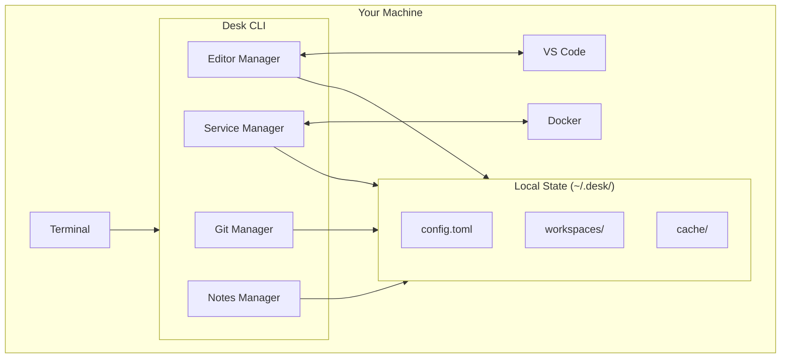

# Desk CLI

[](https://github.com/desksh/desk-cli/actions/workflows/ci.yml)
[](https://github.com/desksh/desk-cli/releases)
[](LICENSE)
[](https://www.rust-lang.org/)

**Developer context switching tool** - Save, switch, and restore your complete development environment in seconds.

```
┌─────────────────────────────────────────────────────────────────┐
│                                                                 │
│   desk open auth-feature                                        │
│                                                                 │
│   ✓ Git branch switched to feature/auth                        │
│   ✓ Stashed changes restored                                   │
│   ✓ Editor state restored (3 files)                            │
│   ✓ Docker services started                                    │
│   ✓ Browser tabs opened (2 tabs)                               │
│                                                                 │
│   Ready to work on: auth-feature                                │
│                                                                 │
└─────────────────────────────────────────────────────────────────┘
```

## The Problem

Every time you switch tasks, you lose 15-30 minutes:

- Stashing changes and switching branches
- Remembering which files you had open
- Restarting development servers
- Finding the right browser tabs
- Loading context back into your brain

**Desk eliminates the hidden tax of context switching** by capturing and restoring complete development contexts.

## Features

- **Instant Context Switch** - Save your complete development state and restore it in seconds
- **Git Integration** - Automatic branch switching, stash management, and worktree support
- **Editor State** - Capture and restore open files, cursor positions, and window layouts
- **Service Management** - Start/stop Docker containers, dev servers, and background processes
- **Browser Tabs** - Save and restore relevant documentation and tool tabs
- **AI-Powered Summaries** - Generate context summaries to help you resume work faster
- **Cross-Platform** - Works on macOS, Linux, and Windows

## Installation

### Quick Install (macOS/Linux)

```bash
curl -fsSL https://getdesk.dev/install.sh | sh
```

### From Source

```bash
cargo install desk
```

### Pre-built Binaries

Download from [GitHub Releases](https://github.com/desksh/desk-cli/releases).

| Platform | Architecture | Download |
|----------|--------------|----------|
| macOS | Apple Silicon | `desk-*-aarch64-apple-darwin.tar.gz` |
| macOS | Intel | `desk-*-x86_64-apple-darwin.tar.gz` |
| Linux | x86_64 | `desk-*-x86_64-unknown-linux-gnu.tar.gz` |
| Linux | musl | `desk-*-x86_64-unknown-linux-musl.tar.gz` |
| Windows | x86_64 | `desk-*-x86_64-pc-windows-msvc.zip` |

## Quick Start

```bash
# Create a new workspace for your current context
desk open auth-feature

# Work on your feature...
# Edit files, run servers, open browser tabs

# Switch to another task (automatically saves current state)
desk switch payments-bug

# List all your workspaces
desk list

# See what's in your current workspace
desk status

# Close current workspace and clean up
desk close
```

## Commands

| Command | Description |
|---------|-------------|
| `desk open <name>` | Create or restore a workspace |
| `desk switch <name>` | Save current state and switch to another workspace |
| `desk close` | Close current workspace and clean up |
| `desk list` | List all workspaces |
| `desk status` | Show current workspace status |
| `desk config` | Manage configuration |

Run `desk --help` for detailed command information.

## Configuration

Desk stores configuration in `~/.desk/config.toml`:

```toml
[general]
# Default editor for workspace notes
editor = "code"

[git]
# Automatically stash uncommitted changes
auto_stash = true
# Use git worktrees for faster switching
use_worktrees = false

[integrations]
# Enable VS Code integration
vscode = true
# Enable Docker integration
docker = true
# Enable browser tab capture
browser = false
```

## How It Works



Desk captures:
- **Git state**: Current branch, stashed changes, uncommitted files
- **Editor state**: Open files, cursor positions, window layout
- **Running services**: Docker containers, dev servers, watchers
- **Notes**: Your personal context notes for each workspace

All data is stored locally in `~/.desk/`.

## Technology

Built with Rust for:
- **Instant startup** (<50ms cold start)
- **Single binary distribution** - no runtime dependencies
- **Cross-platform support** - compile once, run anywhere
- **Memory safety** - no crashes, no undefined behavior

### Core Dependencies

| Library | Purpose |
|---------|---------|
| `clap` | Command-line argument parsing |
| `ratatui` | Terminal user interface |
| `tokio` | Async runtime |
| `serde` | Configuration serialization |
| `git2` | Git operations |

## Development

```bash
# Clone the repository
git clone https://github.com/desksh/desk-cli.git
cd desk-cli

# Build
cargo build

# Run tests
cargo test

# Run with logging
RUST_LOG=debug cargo run -- open my-workspace

# Format and lint
cargo fmt
cargo clippy
```

See [CONTRIBUTING.md](CONTRIBUTING.md) for detailed development guidelines.

## Roadmap

- [x] Core CLI infrastructure
- [ ] Git branch/stash management
- [ ] VS Code integration
- [ ] Docker service management
- [ ] Terminal UI (TUI) mode
- [ ] AI-powered context summaries
- [ ] Team workspace sharing (Pro)

## License

MIT License - see [LICENSE](LICENSE) for details.

## Links

- [Documentation](https://getdesk.dev/docs)
- [GitHub Issues](https://github.com/desksh/desk-cli/issues)
- [Discussions](https://github.com/desksh/desk-cli/discussions)
- [Changelog](CHANGELOG.md)
